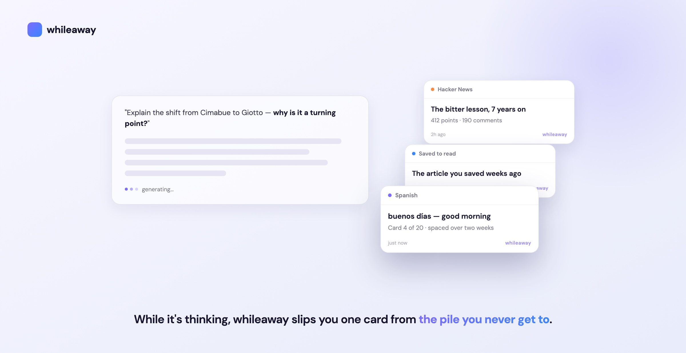

# whileaway

**Your bookmarks, your reading list, that language you meant to learn — the pile you never get to.**

whileaway turns it into a feed only you can read, filled by your AI one sentence at a time, and
slips you one card at a time in the moments you're already idle — while an AI is thinking, on a new
tab, in the seconds you'd otherwise spend waiting.

No ads. No algorithm. Nobody else can reach you here — it's the feed only you can publish to.

## The aha

You don't file anything. You tell your AI agent one sentence — a **recipe** — and it fills a
**lane** in your feed:

> *"Teach me basic Spanish, a little at a time, spaced over two weeks."*
> *"Turn my unread X bookmarks into a card or two a day."*
> *"Queue these Hacker News links to read while I'm waiting on the AI."*
> *"Resurface the commitments I made in today's meetings until I actually act on them."*

Those become **cards**. whileaway shows the single best one per moment — spaced out, deduped,
expiring when it should — so it feels like a feed that's alive, not a to-do list judging you.

## Try it in two minutes

Go to **[whileaway.honestapp.org](https://whileaway.honestapp.org)**, sign in with a magic link,
and the connect page hands you everything — a browser-extension setup code and a one-line snippet
to connect your agent.

Then say a recipe to your agent (any MCP-capable AI, e.g. Claude):

    Add a lane to my whileaway that teaches me one Spanish phrase a day for two weeks.

Open a new tab, or start an AI generation — the first card shows up.

## Why this didn't exist until now

You controlling your own inputs isn't new — it was RSS. It lost to algorithmic feeds on *labor*,
not principle: curating your own reading was work, and platforms made passivity free. Your agent
now does that labor. Filling your own feed used to cost effort per card; with an AI it costs one
sentence per intent. Right for twenty years, practical only in the last eighteen months.

## Private by design

whileaway **never reads your prompts, the AI's answers, the page you're on, or your links.** The
extension only notices *that* a generation started, then asks your feed for the next card. No
trackers, no ads. And "someone spams my feed" isn't possible — you're the only one who can fill it.

## Recipes to steal

Copy one and change a word — more in the recipe book, [`docs/EXAMPLES.md`](docs/EXAMPLES.md):

- *"Every morning, one stoic quote — gone by noon."*
- *"Turn my unread X bookmarks into a card or two a day."*
- *"Remind me about my 10am standup and keep showing it until I've seen it."*
- *"One interesting Wikipedia article whenever I open a new tab."*

## Open source

whileaway is Apache-2.0 and self-hostable — your feed can live entirely on your own machine.
Building on it, running your own, or contributing? Everything technical — self-host, the feed API,
the MCP server, architecture, and contributing — is in
**[`docs/DEVELOPERS.md`](docs/DEVELOPERS.md)**.

[Apache-2.0](./LICENSE) © whileaway contributors.
